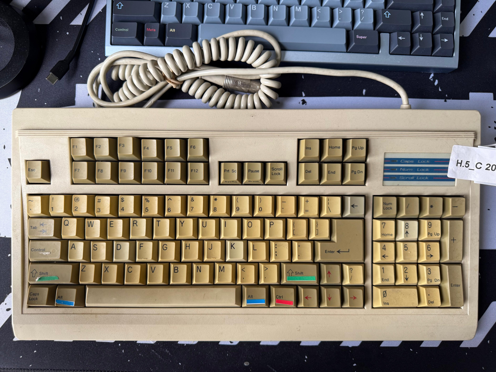

# Unitek K-158 - Reverse Engineering & Documentation 

 

The **Unitek K-158** is a rare mechanical keyboard from the late 1980s, manufactured under Unitek branding and built by Taiwanese OEM **Dah Yang Industry Co., Ltd.** This repository documents the keyboard's physical layout, switch variants, internal matrix, and rewiring information for modern microcontroller conversion and QMK compatibility. 

> 📅 **Manufacture Date (est.):** 14 December 1988  
> 🔌 **Connection:** 5-pin DIN (PC/AT/XT compatible)  
> 🧠 **OEM:** Dah Yang (confirmed from PCB silkscreen)  
> 🔬 **FCC ID:** DKW67MK-158  
> 🔢 **Serial Number:** 001350 

--- 

## Switches 

This board features the extremely rare **Cherry MX Pale Blue** switches, with the following unusual characteristics: 

- Majority of the switches are **Cherry MX Pale Blue** 
- The board I have also has one **Cherry MX Blue** and one **Cherry MX Dark Blue** switch 
- **MX Pale Blue** switches are *lightly tactile* and *softly clicky*, similar in feel to vintage Cherry MX White 
- The Pale Blue switches features: 
    - Truncated slider stems (like vintage MX Whites) 
    - Discolored slider ramps (like MX Dark Blue) 
    - Fewer free spring turns (possibly indicating heavier bottom-out) 

> ⚠️ *The existence of Cherry MX Pale Blue switches remains undocumented in official Cherry datasheets and is considered highly obscure.* 

--- 

## PCB & Matrix Details

- PCB Silkscreen: `Dah Yang Rev 1.2 881214`
- Matrix tracing is ongoing. Continuity maps will be documented soon 
- Photos of the PCB, controller, and traces (soon) are stored in [`assets/`](assets/) 

--- 

## Layout Notes

- Hybrid XT/AT layout
- **Split 1u Backspace** and **Big-ass Enter**
- Function keys arranged in 2 groups of 5
- ANSI-style alphas with nonstandard modifier spacing

> Full layout available in [`unitek-k158-layout.json`](unitek-k158-layout.json) (exported from [Keyboard Layout Editor](http://www.keyboard-layout-editor.com/)). A blank layout [`unitek-k158-blank-layout.json`](unitek-k158-blank-layout.json) is also provided which greatly helps in writing the traces when exported as a PNG. 

--- 

## Rewiring

This repository will also include:
- Rewiring guide for converting to **Pro Micro or RP2040** microcontrollers
- Pin mapping for key matrix
- QMK-compatible firmware templates 

--- 

## About Unitek

> Unitek was a Taiwanese electronics brand founded in 1988. The company did not manufacture keyboards in-house but instead contracted OEMs:

- **Dah Yang Industry Co. Ltd.** for Cherry MX builds
- **NTC (Nan Tan Computer Co.)** for Alps/clone builds

The K-158 is an example of Unitek's collaboration with **Dah Yang**, confirmed through PCB markings. 

--- 

## 🧾 License

All documentation and layout files are under the [MIT License](../LICENSE).

- Photos and diagrams © 2025 Akshay Atam. For attribution/non-commercial reuse only. 

--- 

## External References

- [The Mechanical Keyboard Wiki — Cherry MX Pale Blue](https://wiki.themk.org/index.php/Cherry_MX_Pale_Blue) 
- [FCC ID Database](https://fccid.io/DKW67MK-158)
- [Unitek](https://wiki.themk.org/index.php/Unitek)